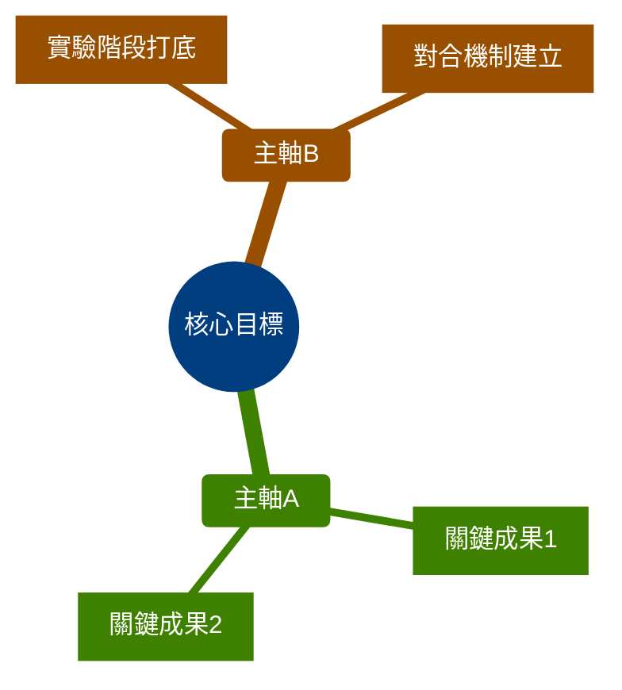
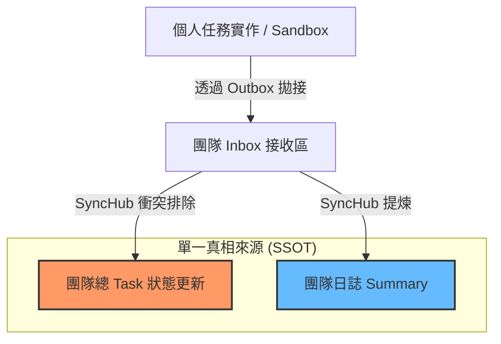
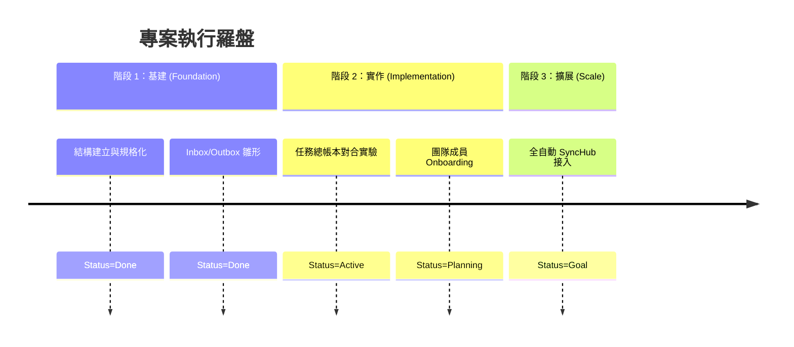

# 戰略進展與架構圖錄範本 (ROADMAP_TEMPLATE)
> **操作說明**：本範本用於團隊層級的 `workmgr/roadmap/`。強烈依賴 Mermaid 語法來進行高階視覺化的戰略與狀態追蹤。本檔案是「戰區羅盤」，指導所有後續 Task 的開展。

---

## 1. 戰略全景圖 (Strategic Mindmap)
> 描述目前核心版圖與支線的發展全貌

## 2. 邏輯與因果鏈條 (Causal Flowchart)
> 描述目前各專案、模組或檔案之間的相互支撐/血緣關係

## 3. 架構演化羅盤 (Evolution Roadmap)
> 橫跨時間的進展狀態與未來規劃 (Roadmap)

## 4. 關鍵進展與大方向調整 (Narrative & Pivots)
- [ ] **里程碑 A 達成**: 完成某某架構。
- [ ] **里程碑 B 達成**: 驗證某項機制的流暢度。

### 關鍵轉向 (Strategic Pivots)
*當團隊面臨重大策略調整時，務必在此留下「為何轉彎」的歷史軌跡。*
- **原本方向**: ...
- **調整後方向**: ...
- **原因**: 發現舊方法在某某限制下無法規模化。

## 5. 歷程隨筆 (Reflections)
> 紀錄團隊在推進戰略時最深刻的一句話或是體悟（供日後文化沈澱）。

這是一場關於「認知效率與對合摩擦力」的實驗...
